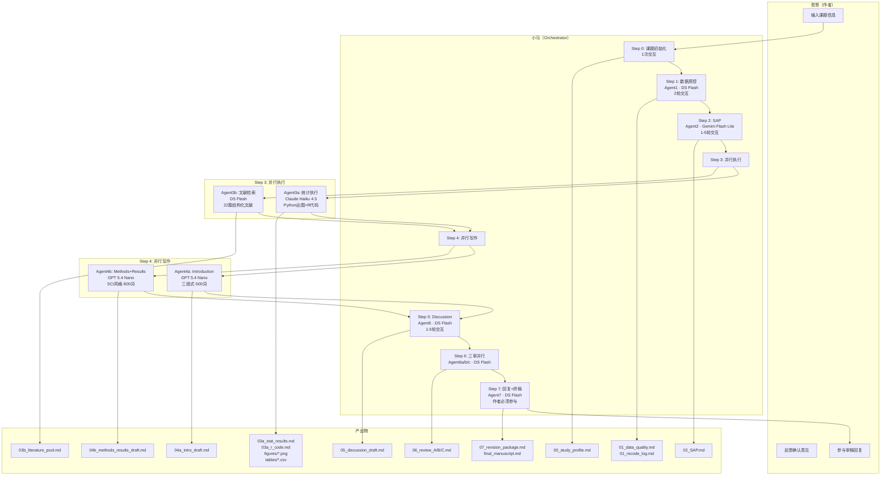

# 临床研究生产线 — Agent & 模型总览

## 一、Agent Prompt 列表

| Agent | 角色设定 | Prompt文件 | 模型 |
|-------|---------|-----------|------|
| **小马** | 调度者/Orchestrator，负责分发任务、呈现中间结果、与哲哥交互 | —（人类） | — |
| **Agent1** | 数据管理+统计专家：质控检查、缺失分析、数据预处理 | 任务驱动（无固定角色文件） | **DeepSeek V4 Flash** |
| **Agent2** | 资深统计专家：制定SAP（研究设计、统计方法、图表计划） | 任务驱动（无固定角色文件） | **CherryIn Gemini 3.1 Flash Lite** |
| **Agent3a** | 金牌统计师：Python生成统计结果+图表，复刻R代码 | 任务驱动（无固定角色文件） | **CherryIn Claude Haiku 4.5** |
| **Agent3b** | 文献检索专家：PubMed深度检索，结构化22篇文献 | 任务驱动（无固定角色文件） | **DeepSeek V4 Flash** |
| **Agent4a** | 资深神经免疫学专家：撰写Introduction（三段式结构） | `agent_intro_role.md` | **CherryIn GPT 5.4 Nano** |
| **Agent4b** | 资深临床研究专家：撰写Methods+Results（SCI规范） | `agent_methods_results_role.md` | **CherryIn GPT 5.4 Nano** |
| **Agent5** | 资深神经免疫学专家：撰写Discussion（7段结构） | `agent_discussion_role.md` | **DeepSeek V4 Flash** |
| **Agent6a** | 审稿人A（临床设计+意义） | 任务驱动 | **DeepSeek V4 Flash** |
| **Agent6b** | 审稿人B（逻辑+证据+写作） | 任务驱动 | **DeepSeek V4 Flash** |
| **Agent6c** | 审稿人C（统计方法） | 任务驱动 | **DeepSeek V4 Flash** |
| **Agent7** | 综合修改专家：逐条回复审稿意见+全文一致性检查 | 任务驱动 | **DeepSeek V4 Flash** |

## 二、模型分配总表

| 模型 | 数量 | 分配的Agent |
|------|------|------------|
| **DeepSeek V4 Flash**（主模型） | 7 | Agent1, Agent3b, Agent5, Agent6a/b/c, Agent7 |
| **CherryIn openai/gpt-5.4-nano** | 2 | Agent4a, Agent4b |
| **CherryIn anthropic/claude-haiku-4.5** | 1 | Agent3a |
| **CherryIn google/gemini-3.1-flash-lite-preview** | 1 | Agent2 |

## 三、已保存的角色设定文件

| 文件 | 适用Agent | 保存位置 |
|------|----------|---------|
| `agent_intro_role.md` | Agent4a | D:\general\ + skill references |
| `agent_methods_results_role.md` | Agent4b | D:\general\ + skill references |
| `agent_discussion_role.md` | Agent5 | D:\general\ + skill references |

## 四、流程图

## 五、试跑耗时实际统计

| Step | Agent | 模型 | 实际耗时 | 产出文件 |
|------|-------|------|---------|---------|
| 0 | 小马+哲哥 | — | ~5min | 00 |
| 1 | Agent1 | DS Flash | ~10min | 01 |
| 2 | Agent2 | Gemini Flash Lite | ~3min | 02 |
| 3a | Agent3a | Claude Haiku + 直接写 | ~20min | 03a + figures + tables |
| 3b | Agent3b | DS Flash | ~2min | 03b |
| 4a | Agent4a v1-v3 | GPT 5.4 Nano | ~15min | 04a |
| 4b | Agent4b v1-v3 | GPT 5.4 Nano | ~15min | 04b |
| 5 | Agent5 v1-v2 | DS Flash | ~4min | 05 |
| 6 | Agent6a/b/c | DS Flash | ~3min | 06 |
| 7 | Agent7 | DS Flash | ~3min | 07 + final |
| **总计** | **13个Agent** | **4种模型** | **~80min** | **23个文件** |
